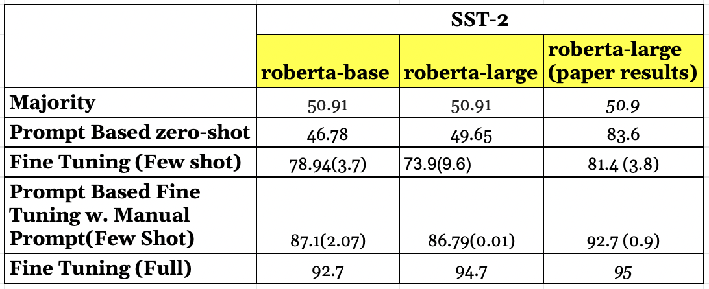
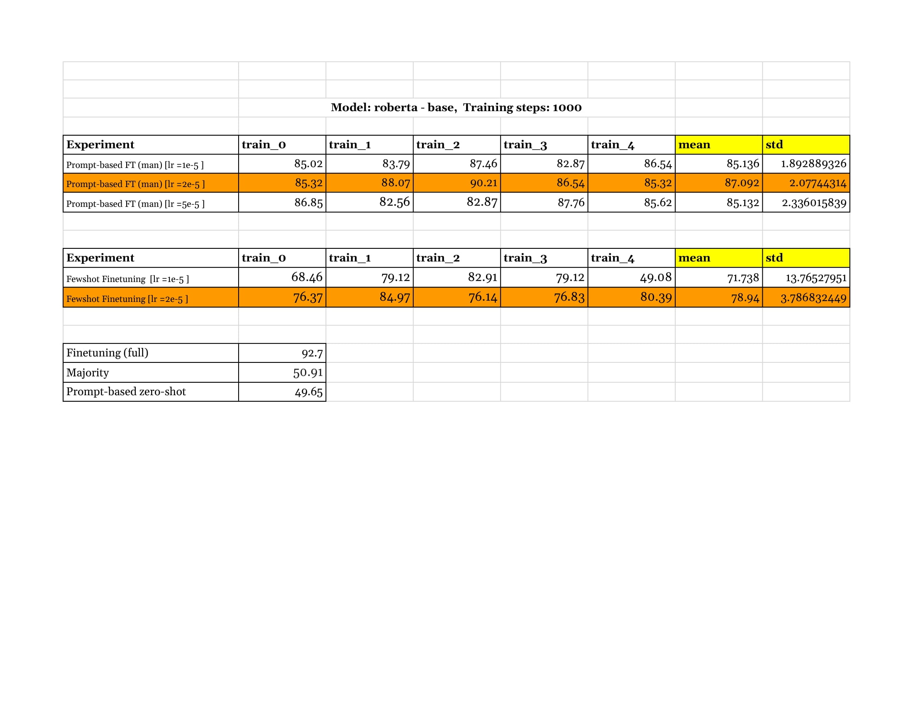

# Prompt with Masked Language Modeling for finetuning LLMs
Masked Languag Modelling entails masking a part of input sequence and then training a model to predict the masked tokens. How can we prompt a pretrained model to predict the sentiment, or topic classification. 
Reproducing 'Making Pretrained Language Models Better Few-Shot Learners' (Gao et al. 2021). Zero-shot and few-shot prompt-based fine-tuning with RoBERTa-large.

### Examples

Main results -

Experiment results on `roberta-base`

                                                            
